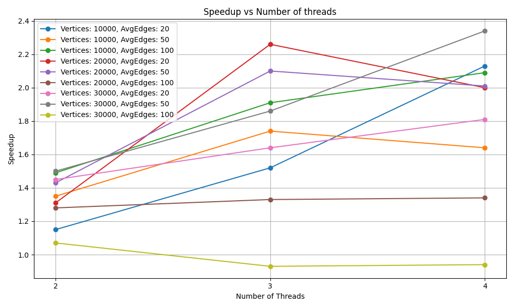
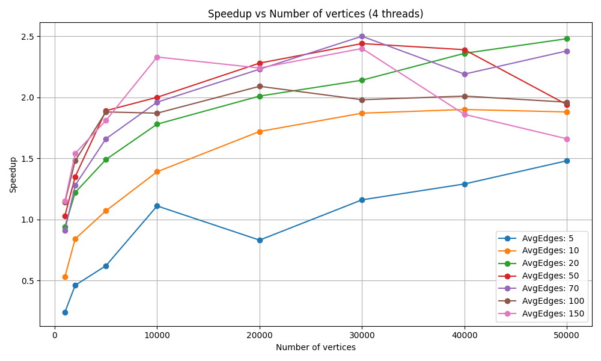
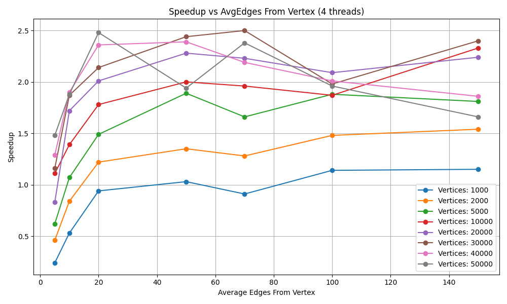

# 🚀 Parallel Bellman-Ford Algorithm in Java

This project presents a **parallel implementation of the Bellman-Ford shortest path algorithm** in **Java**, designed to maximize **speedup** and **CPU core utilization** using modern multithreading techniques.  

The work compares the traditional **sequential** implementation with a **parallelized** one, evaluates performance on large graphs, and demonstrates how effective parallelization can significantly reduce computation time on multi-core systems.


## 📌 Project Aim

- Implement both **sequential** and **parallel** versions of the Bellman-Ford algorithm.  
- Leverage **Java’s concurrency API (`java.util.concurrent`)** for efficient multithreading.  
- Analyze **scalability, speedup, and efficiency** when increasing:
  - number of vertices  
  - graph connectivity (edges per vertex)  
  - number of threads  
- Verify correctness of parallel execution against the sequential baseline.  
- Provide benchmarks, CSV outputs, and **visualized performance diagrams**.  


## 🧩 Algorithm Overview

- **Bellman-Ford** is a classical single-source shortest path algorithm. Unlike Dijkstra, it supports **negative edge weights**.  
- Complexity: **O(|V||E|)** → expensive for large graphs.  
- Key observation: **edges can be processed independently within an iteration**. This independence enables **parallelization**.

### Sequential Implementation
- Iterates over all edges `|V| - 1` times.  
- Stops early if no updates occur in an iteration.  
- Detects negative cycles with an additional pass.  

### Parallel Implementation
- **Edges are partitioned into disjoint groups**, ensuring all edges with the same destination belong to the same group (avoiding write conflicts).  
- Each group is processed by a dedicated thread within a **thread pool**.  
- Synchronization via **`AtomicBoolean`** tracks updates across threads.  
- Negative cycle detection is also parallelized.  


## 📊 Results & Analysis

The experiments confirm:

- **Best speedup** is achieved when `#threads = #CPU cores`.  
- With **4 threads on a 4-core CPU**, speedup stabilized between **1.7× and 2.5×**.  
- Speedup grows with **graph size** and **connectivity**.  
- For **sparse or small graphs**, sequential execution is often more efficient (parallel overhead dominates).  
- **Efficiency drops** with threads > cores → overhead > gain.  

### Experiments results

<p align="center">
  <br>
  <em>Speedup vs number of threads</em>
</p>

<p align="center">
  <br>
  <em>Speedup vs number of vertices</em>
</p>

<p align="center">
  <br>
  <em>Speedup vs graph connectivity</em>
</p>


## 🖥️ Running Locally

### Requirements
- Java 23+ (OpenJDK recommended)  
- Python 3.10+ (for plotting diagrams)  
- `matplotlib` & `pandas` (if using Python scripts)

### Steps
```bash
# 1. Clone repo
git clone https://github.com/pgerasymchuk/BellmanFord.git
cd BellmanFord

# 2. Compile Java code
javac *.java

# 3. Run experiments
java Main

# CSV output will be written to:
#   test1.csv
#   test2.csv

# 4. Generate plots (optional)
cd visualizations
python parallel_visualization.py
python sequential_visualization.py
```


## 🔮 Future Improvements
- GPU-based CUDA/OpenCL version.  
- Distributed implementation for very large graphs.  
- Adaptive workload balancing (dynamic thread assignment).  


## 📚 References
- Cormen, T. H. et al. *Introduction to Algorithms* (MIT Press, 4th ed.).  
- Hua, Zhe. *Parallel Bellman-Ford Algorithm* (Columbia University, 2020).  
- Gaurav Hajela et al. *Hybrid Parallel Shortest Path Solvers* (IJCA, 2014).  
- Oracle JDK 23 API Specification.  
